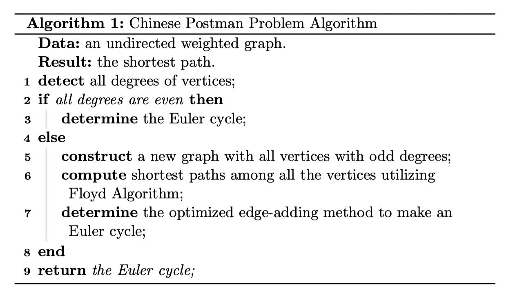

# Chinese Postman Algorithm

## Essence

-   Euler cycle always gives the shortest Chinese Postman path.
-   If the graph does not contain an Euler cycle, add edges to create one.

## Pseudo-code

## Implementation

==**This code is borrowed from another repo. Turn to `Workspace/readme` for more info.**==

### 